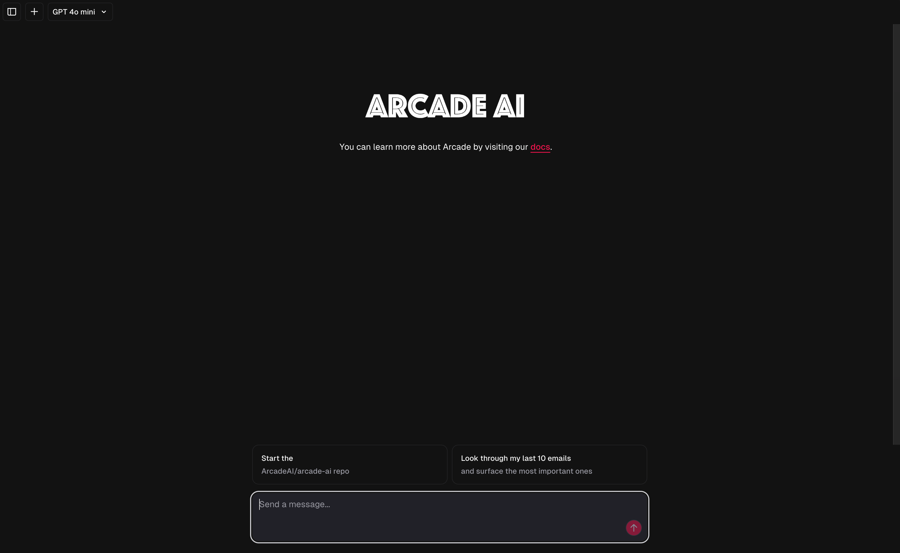

<p align="center">
  <a href="https://arcade-ai.com/">
    <h1 align="center">Arcade AI Chatbot</h1>
  </a>
</p>

<p align="center">
  A chatbot interface for Arcade AI tools, built with Next.js and the Arcade AI SDK.
  Based on the <a href="https://github.com/vercel/ai-chatbot">Vercel AI Chatbot</a> template.
</p>

<p align="center">

</p>

<p align="center">
  <a href="#features">Features</a> •
  <a href="#prerequisites">Prerequisites</a> •
  <a href="#installation">Installation</a> •
  <a href="#configuration">Configuration</a> •
  <a href="#development">Development</a> •
  <a href="#deployment">Deployment</a>
</p>

## Features

- 🤖 Interactive chatbot interface for Arcade AI tools
- ⚡️ Built with Next.js for optimal performance
- 🛠 Seamless integration with Arcade AI SDK
- 🔄 Support for both cloud and local development environments
- 💬 Real-time chat interactions
- 🎨 Clean and intuitive user interface

## Prerequisites

Before you begin, ensure you have installed:

- Node.js 18.x or later
- pnpm (recommended) or another package manager
- An Arcade AI account with API access

## Installation

1. Clone the repository:

```bash
git clone https://github.com/sdserranog/arcade-chatbot.git
cd arcade-chatbot
```

2. Install dependencies:

```bash
pnpm install
```

## Configuration

### Environment Variables

Copy the [`.env.example`](.env.example) file to create your own `.env`:

```bash
cp .env.example .env
```

Configure the following environment variables:

| Variable            | Required | Default   | Description                 |
| ------------------- | -------- | --------- | --------------------------- |
| `ARCADE_API_KEY`    | Yes      | -         | Your Arcade AI API key      |
| `ARCADE_ENGINE_URL` | No       | Cloud URL | Engine URL (Local or Cloud) |
| `ARCADE_USER_ID`    | No       | 'dev'     | Your Arcade user ID         |

> ⚠️ **Security Note**: Never commit your `.env` file to version control. It contains sensitive API keys that should remain private.

## Development

### Running Locally

1. Start the development server:

```bash
pnpm dev
```

2. Open [http://localhost:3000](http://localhost:3000) in your browser

### Local Toolkit Development

To develop and test your own tools:

1. Follow the [Arcade AI documentation](https://docs.arcade-ai.com/home/build-tools/create-a-toolkit) to create your toolkit

2. Start the local engine and actor:

```bash
arcade dev
```

3. Update `ARCADE_ENGINE_URL` in your `.env` to point to your local endpoint

4. Run the development server:

```bash
pnpm dev
```

## Deployment

The application can be deployed to any platform that supports Next.js applications. Follow the standard deployment procedures for your chosen platform.
